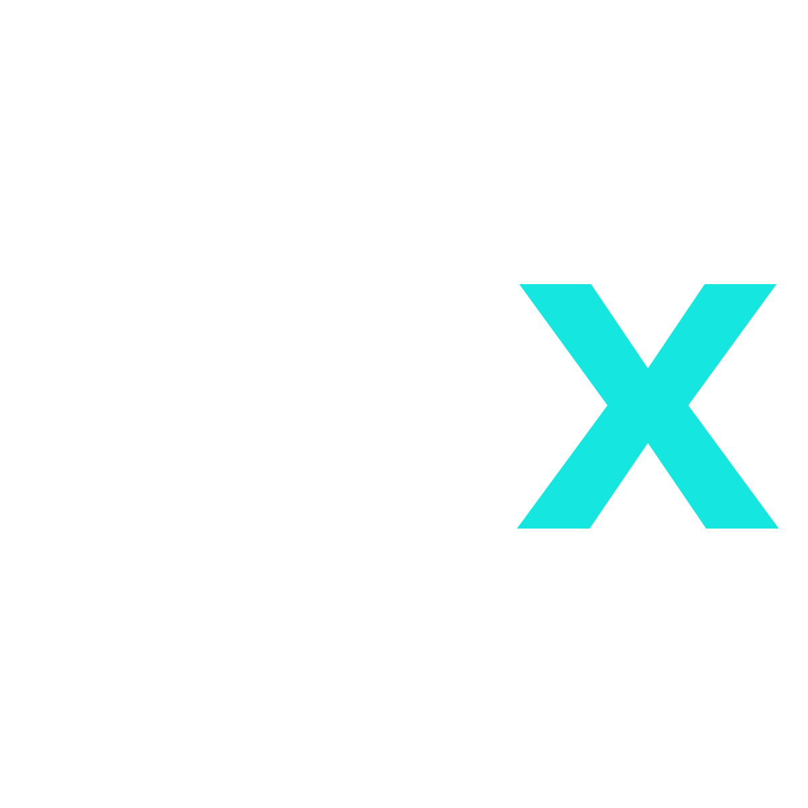

# ASX earn — Skeleton (Next.js + thirdweb)

A production-grade shell for ASX's new dApp with modern UI/UX, thirdweb wallet integration, and pre-wired multi-chain configuration for BSC and CORE.

> Design targets: minimal, professional, Uniswap-level polish; left sidebar nav; top-right wallet connect; components ready for staking & NFT analytics.



## 1) Stack

- **Next.js 14 (App Router)** + **TypeScript**
- **Tailwind CSS** (custom palette using ASX cyan)
- **thirdweb v5** for wallet connect & contract calls
- Opinionated structure for **staking**, **NFT**, **ecosystem**, **docs**

## 2) Quick start

```bash
# 0) Requirements
# Node 18.18+

# 1) Install deps
npm install

# 2) Copy env
cp .env.example .env
# Fill NEXT_PUBLIC_THIRDWEB_CLIENT_ID with an API key from thirdweb Dashboard
# (The code will fall back to THIRDWEB_TEAM_ID if you don't set it.)

# 3) Dev
npm run dev

# 4) Build / Start
npm run build && npm run start
```

> **thirdweb**: Visit https://thirdweb.com/dashboard/settings/api-keys and create a **Client ID**. Put it in `.env` as `NEXT_PUBLIC_THIRDWEB_CLIENT_ID`. (We also kept `THIRDWEB_TEAM_ID` you supplied; the app will use it if `NEXT_PUBLIC_THIRDWEB_CLIENT_ID` is blank.)

## 3) Environment

The project already includes `.env` with your values (per request). Do **not** commit it publicly.

- CoinGecko Pro used for price tiles.
- RPCs for BSC and CORE are read from env.
- CoreScan API keys placeholders are present for future use (subgraphs, explorers, etc.).

## 4) Where to plug logic

- **Staking**: `app/(routes)/staking/page.tsx` draws pool cards; contracts are in `data/staking.ts`. Drop your real ABIs in `abis/staking.json` and wire reads/writes using `thirdweb`'s `getContract` + `readContract`, or generate types with `solc`/`typechain` later.
- **NFT**: `app/(routes)/nft/page.tsx` is a placeholder; you can embed any thirdweb ERC721/1155 contract UI there. We ship Docs and Terms under `/docs` for quick legal linking.
- **Prices**: `lib/price.ts` queries CoinGecko Pro (BSC chain) and maps **ASX on CORE** to the BSC contract you provided for pricing parity.
- **Chains**: `lib/thirdweb.ts` defines BSC and CORE through `defineChain` and instantiates the client from env.
- **Explorers**: `lib/scanners.ts` creates links for BscScan/CoreScan.

## 5) Address book (already wired)

- **BSC Tokens**: `data/tokens.ts`
- **CORE Tokens**: `data/tokens.ts`
- **BSC LPs**: `data/tokens.ts`
- **Staking Contracts**: `data/staking.ts`

## 6) UX / Layout

- Sidebar: Overview, NFT, Staking, Ecosystem, with **Docs at the bottom**.
- Top-right: thirdweb **ConnectButton**.
- Left-top: **ASX** logo (X is brand gradient).
- Colors are pulled from the cyan in your logo; tune them in `tailwind.config.ts`.

## 7) Security / Compliance

- The **Docs** route ships with PDFs you supplied so the app can surface legal terms inline.
- Add gating if needed: protect `/docs` or NFT actions based on address roles.
- Never expose private keys or admin RPCs in the browser.

## 8) Next steps (recommended)

- Replace staking placeholder ABI with your actual contracts; add hooks in `lib/` for apr, tvl, user positions.
- Add subgraph or indexer for **NFT stats**.
- Unit tests with Vitest + React Testing Library.
- Optional: Dockerfile + CI (GitHub Actions) with `pnpm` and `turbo` cache.

---

© ASX Capital — skeleton generated for internal use.
